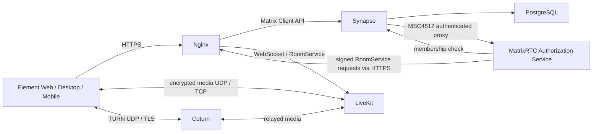

# Собственный Matrix + Element + MatrixRTC

Инфраструктура для Ubuntu VPS: 2 vCPU, 4 ГБ RAM, SSD 40 ГБ, один публичный IPv4,
закрытая группа 6–10 пользователей. Synapse обслуживает переписку и файлы,
Element Web — веб-интерфейс, LiveKit — аудио/видео SFU, MatrixRTC Authorization
Service проверяет доступ к звонкам, Coturn помогает соединениям через NAT.
Все сервисы контейнеризированы; **на VPS нет сборки образов**.

Домены подготовлены для **cateam.online**:

| Адрес | Назначение |
|---|---|
| `https://chat.cateam.online` | Element Web |
| `https://matrix.cateam.online` | Matrix API и discovery |
| `wss://rtc.cateam.online/livekit/sfu` | WebSocket LiveKit |
| `rtc.cateam.online:3478 / :5349` | STUN/TURN и TURN/TLS |

Идентификатор пользователя: `@alice:matrix.cateam.online`.
`MATRIX_DOMAIN` является постоянной идентичностью сервера: после создания аккаунтов
его менять нельзя. Корневой `cateam.online` не требуется для данной схемы.

## Архитектура и версии



Используется современная application service интеграция MatrixRTC: Synapse
публикует transport registry, проверяет Matrix access token и проксирует
`/_matrix/client/unstable/io.element.msc4195/rtc/livekit/get_token` в авторизационный
сервис. Тот проверяет членство в комнате и выдаёт подписанный LiveKit JWT.
`room.auto_create: false` исключает создание SFU-комнат в обход этого решения.
Авторизационный сервис не публикуется напрямую в интернет. SFU webhook помогает
обработать выход участников, а delayed events Synapse страхуют сигнализацию.
Прежний публичный `/sfu/get` и `livekit_service_url` в проекте не используются.

Совместимость настроек проверена по **исходникам закреплённых релизов**, а не
только по README. В Synapse 1.162.0 appservice registration использует ключи
`io.element.msc4502.scopes`, `io.element.msc4512.proxy_prefix` и
`io.element.msc4512.proxy_url`; transport содержит `url`, а не deprecated
`livekit_service_url`. Эти различия важны: описание lk-jwt-service содержит
также draft/stable имена, которые данный Synapse не читает.

| Компонент | Версия / источник |
|---|---|
| Synapse | `ghcr.io/element-hq/synapse:v1.162.0` |
| PostgreSQL | `postgres:18.6-alpine` |
| Element Web | `v1.12.30`, официальный release tarball |
| nginx | `nginx:1.30.4-alpine` |
| LiveKit | `livekit/livekit-server:v1.13.8` |
| MatrixRTC auth | `ghcr.io/element-hq/lk-jwt-service:0.7.0` |
| Coturn | `coturn/coturn:4.18.0-r0` |
| Certbot | `certbot/certbot:v5.8.0` |
| Временные volume tools | `alpine:3.24` |

Версии проверены 06.10.2026. Все указанные Docker tags найдены в реестрах;
это не означает, что запуск контейнеров или звонки уже проверены здесь.
Для обновления изменить `versions.env` и при необходимости Dockerfile, затем
прогнать CI. GitHub собирает только собственный образ `web`, содержащий nginx
и официальную статику Element, включая встроенный интерфейс Element Call.
Остальные компоненты загружаются из upstream-реестров без модификаций.

Redis не нужен для выбранной **одноузловой** конфигурации LiveKit. Нет
распределения нагрузки, recording/egress или многосерверного кластера.
Состояние задач авторизационного сервиса находится в памяти: его перезапуск
может прервать обслуживание активных звонков; delayed events не заменяют
планирование обновлений вне звонков. Переход к HA потребует другой архитектуры.

Официальные источники:

- [Element Call self-hosting](https://github.com/element-hq/element-call/blob/main/docs/self_hosting.md).
- [lk-jwt-service 0.7.0: application service](https://github.com/element-hq/lk-jwt-service/blob/v0.7.0/README.md).
- [Synapse 1.162.0: MatrixRTC config](https://github.com/element-hq/synapse/blob/v1.162.0/synapse/config/matrixrtc.py).
- [Synapse: application service config parser](https://github.com/element-hq/synapse/blob/v1.162.0/synapse/config/appservice.py).
- [LiveKit: deployment and networking](https://docs.livekit.io/transport/self-hosting/deployment/).
- [LiveKit 1.13.8 configuration](https://github.com/livekit/livekit/blob/v1.13.8/config-sample.yaml).
- [Coturn configuration reference](https://github.com/coturn/coturn/blob/master/examples/etc/turnserver.conf).
- [Synapse: PostgreSQL](https://element-hq.github.io/synapse/latest/postgres.html).

## Структура

```text
.github/workflows/build.yml       сборка, функциональная CI-проверка, GHCR, опциональный SSH
compose.yaml                     production services, networks, named volumes
versions.env                     закреплённые upstream images
.env.example                     публичные параметры и пустые секреты
config/                          шаблоны Synapse, LiveKit, Coturn и nginx
docker/nginx/Dockerfile           собственный nginx + Element образ
scripts/render.py                проверка параметров и генерация конфигов
scripts/manage.py                операции deploy/backup/restore/renew/user
scripts/probe.py                 HTTPS, MatrixRTC API и WebSocket проверки
scripts/{deploy,backup,restore}.sh удобные оболочки
ops/                             systemd timers для TLS и контроля диска
tests/                           локальные проверки без работающего Docker daemon
runtime/ .state/ .env backups/    создаются локально и исключены из Git
```

Секретов в шаблонах нет. `make init` генерирует криптографически случайные
значения, повторный запуск сохраняет существующие. `.env` имеет права 600,
`runtime/`, `.state/`, `backups/` — 700. Внутри runtime доступны контейнерам
только необходимые подкаталоги. Не помещать эти файлы в Git или build artifacts.

## 1. Подготовка чистого Ubuntu VPS

Рекомендуется **Ubuntu 24.04 LTS amd64**. Нужен Python 3.12+ для безопасного
распаковывания резервных архивов. Установить Docker Engine и Compose v2 с `--wait`
по [официальной инструкции](https://docs.docker.com/engine/install/ubuntu/).
Не использовать старый `docker-compose` v1. Затем:

```bash
sudo apt update
sudo apt install -y make python3 git openssl ca-certificates
sudo usermod -aG docker "$USER"
# Перезайти в SSH после изменения группы.
docker version
docker compose version
sudo install -d -o "$USER" -g "$(id -gn)" /opt/matrix-infrastructure
cd /opt/matrix-infrastructure
# Загрузить сюда файлы или клонировать собственный приватный репозиторий.
```

Группа docker имеет права уровня root. Использовать отдельного SSH-пользователя,
SSH-ключ и доступ только доверенных администраторов. PostgreSQL entrypoint
работает от root только для начальной подготовки volume, затем переключается
на postgres. nginx master читает закрытый TLS-ключ и слушает порты 80/443;
workers работают от nginx. Synapse, LiveKit, auth и Coturn явно запускаются
с непривилегированными UID. Временный tools-контейнер использует root для
назначения владельцев volumes и восстановления; `privileged` нигде не нужен.

Swap 1–2 ГБ полезен как страховка, но не заменяет память при длительной нагрузке.
Проверить `swapon --show`; если swap нет и провайдер разрешает:

```bash
sudo fallocate -l 1G /swapfile
sudo chmod 600 /swapfile
sudo mkswap /swapfile
sudo swapon /swapfile
echo '/swapfile none swap sw 0 0' | sudo tee -a /etc/fstab
```

Не выполнять повторно для существующего swap-файла.

## 2. DNS и firewall

Создать три DNS A-записи с одним IPv4 VPS:

```text
chat.cateam.online    → PUBLIC_IPV4
matrix.cateam.online  → PUBLIC_IPV4
rtc.cateam.online     → PUBLIC_IPV4
```

Не включать CDN/HTTP proxy у DNS-провайдера: адрес RTC должен вести прямо на VPS.
AAAA не добавлять, пока IPv6 не настроен и не проверен. HTTPS должен работать
с доверенным сертификатом, а не self-signed сертификатом.

| Порт по умолчанию | Протокол | Назначение |
|---|---|---|
| 22 | TCP | SSH; ограничить административными адресами, если возможно |
| 80 | TCP | ACME HTTP-01 и HTTP → HTTPS |
| 443 | TCP | Element, Matrix API, LiveKit WSS и RoomService |
| 7881 | TCP | LiveKit ICE/TCP fallback, без HTTP reverse proxy |
| 7882–7883 | UDP | LiveKit UDP mux для двух vCPU |
| 3478 | UDP/TCP | Coturn STUN/TURN |
| 5349 | TCP | Coturn TURN/TLS |
| 49160–49359 | UDP | Coturn relay allocation range |

Открыть эти порты у провайдера и на VPS. Например, для UFW после разрешения SSH:

```bash
sudo ufw allow OpenSSH
sudo ufw allow 80/tcp
sudo ufw allow 443/tcp
sudo ufw allow 7881/tcp
sudo ufw allow 7882:7883/udp
sudo ufw allow 3478/tcp
sudo ufw allow 3478/udp
sudo ufw allow 5349/tcp
sudo ufw allow 49160:49359/udp
```

Docker port publishing может обходить UFW; дополнительно использовать firewall
провайдера или DOCKER-USER правила. PostgreSQL 5432, Synapse 8008, LiveKit 7880
и auth 8080 **не публикуются**. Coturn использует host network ради relay/NAT
и не подключён к Docker bridge networks; его CLI отключён, внутренние адреса
запрещены как relay targets. LiveKit использует bridge с явным public candidate
и узким UDP mux диапазоном. Это экономит количество DNAT правил, но пригодность
сетевого пути нужно проверить на реальном VPS.

При provider NAT указать `TURN_RELAY_IPV4` — адрес интерфейса VPS, а
`PUBLIC_IPV4` — внешний адрес. При прямом публичном адресе `TURN_RELAY_IPV4`
оставить пустым. Все медиапорты должны отображаться 1:1.

TURN/TLS на 5349 помогает при блокировке UDP. Сети, разрешающие **только TCP 443**,
могут не пропускать этот TURN. На одном IPv4 TCP 443 занят HTTPS nginx:
TURN/TLS нельзя вставить в `location` HTTP-прокси. Для такого корпоративного
доступа потребуется отдельная L4/SNI-архитектура или дополнительный IP; текущая
схема не гарантирует соединение из любой ограниченной сети.

## 3. GitHub Actions, GHCR и Secrets

Загрузить проект в собственный приватный GitHub-репозиторий с веткой `main`
или `master`. Workflow работает на `linux/amd64`, использует layer cache,
поддерживает `workflow_dispatch`, pull requests и теги `v*`.

Последовательность: локальные config/security tests → сборка `web` → запуск всех
upstream контейнеров с production-лимитами → API-тест переписки, файла,
MatrixRTC JWT и WebSocket → перезапуск → проверка сохранения данных → реальный
backup/restore в новые volumes → публикация. PR проверяется без публикации.
Секреты disposable CI случайные, тестовый CA доверяется явно; проверка TLS
авторизационного сервиса не отключается.

Теги собственного образа:

```text
ghcr.io/owner/repository/web:main
ghcr.io/owner/repository/web:sha-<полный Git SHA>
ghcr.io/owner/repository/web:vX.Y.Z  # для push соответствующего git tag
```

Публикация использует `GITHUB_TOKEN` с `packages: write`. После первой сборки
проверить в GitHub Packages private visibility и права доступа репозитория.
На VPS один раз выполнить `docker login ghcr.io` с PAT classic `read:packages`,
имеющим доступ к приватному пакету; при необходимости разрешить SSO организации.
Токен вводится в поле Password, не хранится в `.env` и не передаётся в аргументах.

**Автодеплой выключен по умолчанию.** Для включения создать GitHub Environment
`production`, repository/environment variable `DEPLOY_ENABLED=true` и Secrets:

| Secret | Значение |
|---|---|
| `VPS_HOST` | IP или SSH hostname VPS |
| `VPS_PORT` | SSH порт, обычно 22 |
| `VPS_USER` | SSH-пользователь с доступом к Docker и каталогу проекта |
| `VPS_PATH` | `/opt/matrix-infrastructure` |
| `VPS_SSH_KEY` | Приватный deploy SSH key |
| `VPS_KNOWN_HOSTS` | Проверенная запись OpenSSH known_hosts для VPS |

Получить host key через доверенный канал и сравнить fingerprint с консолью VPS;
результат `ssh-keyscan` без проверки не подтверждает подлинность сервера.
`StrictHostKeyChecking=yes` обязателен в скрипте. При нестандартном SSH-порте
known_hosts использует `[host]:port`.

Один раз вручную инициализировать и запустить сервер. Затем workflow после
успешной публикации основной ветки сохраняет полную копию работающей установки,
загружает **только отслеживаемые Git файлы**, меняет `IMAGE_TAG` на проверенный SHA
и выполняет `make update`. Production `.env` не приходит с GitHub и не затирается.
Нет `git reset`, `docker build` или автоматического удаления данных.
Для отключения установить `DEPLOY_ENABLED=false`. Environment approval можно
включить самостоятельно; проект его не требует. Обновления выполнять вне звонков.

## 4. Первоначальное развёртывание и TLS

```bash
cd /opt/matrix-infrastructure
make init
nano .env
docker login ghcr.io -u YOUR_GITHUB_USER
make deploy
```

В `.env` уже стоят домены cateam.online. Заполнить **PUBLIC_IPV4**, рабочий
`LETSENCRYPT_EMAIL` и `IMAGE_PREFIX=ghcr.io/your-owner/your-repository`.
Для первого запуска можно оставить `IMAGE_TAG=main`, затем фиксировать SHA.
Не менять `COMPOSE_PROJECT_NAME` после запуска: это изменит имена volumes.
Не использовать кавычки, `export`, `$()` и inline comments в `.env`.

`make init` создаёт независимые случайные секреты PostgreSQL, admin registration,
Synapse, LiveKit, TURN и application service. `make configure` создаёт runtime
конфиги. Signing key Synapse создаёт и сохраняет в `synapse_data`; это не TLS-ключ.
После первого запуска нельзя менять пароль существующего PostgreSQL простой
правкой `.env`: потребуется отдельная согласованная процедура смены пароля БД.

`make deploy` проверяет конфигурацию и дисковый резерв, скачивает все образы,
инициализирует права volume и идентичность сервера, запускает HTTP nginx для
ACME, получает один SAN-сертификат для трёх доменов и включает HTTPS.
Ключ для Coturn копируется в отдельный volume с UID 10001 и правами 600.
Если сертификат уже существует, bootstrap этап пропускается. При ACME-ошибке
исправить DNS/порты и повторить команду. До выпуска HTTPS остальные HTTP-запросы
получают 503. Никаких фиктивных сертификатов в production не создаётся.

### Автоматическое обновление сертификатов и дисковый резерв

```bash
sudo cp ops/matrix-renew.service ops/matrix-renew.timer /etc/systemd/system/
sudo cp ops/matrix-monitor.service ops/matrix-monitor.timer /etc/systemd/system/
sudo systemctl daemon-reload
sudo systemctl enable --now matrix-renew.timer matrix-monitor.timer
systemctl list-timers 'matrix-*'
make renew
make monitor
```

Для другого каталога изменить `WorkingDirectory` и `ExecStart` в service files.
Certbot проверяется дважды в сутки, nginx перечитывает сертификат. Coturn
перезапускается **только при смене сертификата**: текущие TURN allocations
могут кратко переподключиться. Порт 80 должен оставаться доступен.
`make cert` переиздаёт SAN-сертификат, если изменён Element/RTC-домен;
Matrix-domain существующей установки менять нельзя.

Раз в минуту monitor проверяет диск проекта и `/var/lib/docker`. При резерве
меньше `MIN_FREE_DISK_GB` создаёт guard-файл: новые загрузки через nginx получают
HTTP 507. После освобождения места загрузки включаются автоматически без reload.
Это снижает риск переполнения, но не является filesystem quota: уже начатые
загрузки и рост БД могут расходовать место между проверками. Порог по умолчанию
5 ГиБ. Таймеры сообщают ошибки через systemd journal; внешний канал оповещений
нужно подключать отдельно, если требуется уведомление администратору.

## 5. Пользователи, Element и шифрование

```bash
make admin ACCOUNT=admin
make user ACCOUNT=alice
make user ACCOUNT=bob
```

Пароль вводится скрыто дважды, минимум 12 символов; в argv и логи он не попадает.
Admin API доступен только из контейнера, публичная регистрация выключена.
Открыть `https://chat.cateam.online`, войти под созданным пользователем,
создать приватную комнату, пригласить других локальных пользователей.

Использовать MatrixRTC-совместимые актуальные **Element Web, Element Desktop**,
а на Android/iOS — **Element X**, поддерживающий парольный вход выбранной версией
клиента. Synapse имеет встроенный Sliding Sync; отдельный sliding-sync proxy
не разворачивается. Matrix Authentication Service/OIDC не входит в данный стек:
QR/OIDC-вход и требующие MAS функции не предоставляются. Совместимость конкретной
мобильной версии подтвердить при приёмке; старая Element Classic имеет иной стек
звонков и не является целевым клиентом группового MatrixRTC.

В поддерживаемой комнате включить E2EE, проверить/верифицировать устройства и
сохранить recovery key вне сервера. Серверная копия БД не заменяет пользовательские
ключи расшифровки. MatrixRTC шифрование медиа зависит от поддерживаемого клиента;
его состояние проверить в реальном звонке. Проект не записывает видеозвонки.

## 6. Проверка переписки и звонков

```bash
make config
# Также допустимо: docker compose --env-file .env --env-file versions.env config --quiet
make smoke
make rtc-check
```

`make config` не печатает секреты. Полный `docker compose config` может вывести
сгенерированные пароли: не публиковать такой вывод. `make smoke` проверяет HTTPS,
discovery, доступность Synapse/Element/LiveKit и блокировку admin/federation API.
`make rtc-check` запрашивает существующий аккаунт, создаёт приватную тестовую
комнату и маленький файл, проверяет сообщение, файл, transport registry,
подпись JWT и реальный WebSocket upgrade SFU. После теста выполняет logout;
тестовая комната остаётся в аккаунте. API-проверка не публикует аудио/видео.

**Обязательная ручная приёмка** подробно описана в [docs/acceptance.md](docs/acceptance.md):
6 участников, разные сети, Android, выключенный UDP, screen sharing, шифрование,
перезапуск, восстановление, длительная нагрузка и потребление ресурсов.
До её проведения нельзя считать звонки или производительность доказанными.

## 7. Ресурсы, диск и федерация

| Сервис | Максимум RAM |
|---|---:|
| Synapse | 1536 МиБ |
| PostgreSQL | 512 МиБ |
| LiveKit | 1024 МиБ |
| MatrixRTC auth | 256 МиБ |
| Coturn | 256 МиБ |
| nginx + Element | 128 МиБ |
| Постоянные сервисы, сумма лимитов | 3712 МиБ |

Это верхние пределы, не предвыделение памяти и не измерение потребления.
При одновременном приближении всех сервисов к лимитам памяти ОС не хватит;
следить за реальными пиками и OOM. Настройки ориентированы на небольшую группу:
PostgreSQL shared_buffers 128 МБ, work_mem 2 МБ, 40 connections;
Synapse cache factor 0.3, pool 2–10, URL previews/search/presence выключены.
Redis, Prometheus и Grafana отсутствуют. Certbot/tools работают временно.

Видеозвонки ограничены максимумом 10 участников. LiveKit пересылает медиа,
а не транскодирует, однако нагрузка зависит от числа видеопотоков, выбранного
качества, screen sharing, TURN и пропускной способности VPS. Начать с 360p/720p,
проверить длительный шестисторонний звонок, затем менять настройки.
**Гарантии производительности без нагрузочного теста нет.**

Размер одного вложения ограничен 50 МБ на nginx и Synapse. Суммарной квоты
пользователя здесь нет. История, вложения и БД сохраняются без автоматического
удаления. WAL имеет целевой предел 512 МБ, который PostgreSQL может временно
превышать. Неиспользуемые файлы удалять только через поддерживаемые admin API
Synapse по выбранной политике, не через `rm` в media_store.

```bash
make doctor             # RAM/CPU, Docker disk, free disk, размер БД
make status
make logs
make monitor
make prune              # только dangling images старше недели; не volumes/rollback tags
```

Логи каждого контейнера ограничены 3 × 10 МБ. Многократные обновления оставляют
помеченные SHA-образы для отката; удалять ненужные старые версии адресно после
проверки `docker image ls`. Не применять `docker system prune --volumes`.
Резервные копии выгружать с VPS: хранение нескольких полных копий на SSD 40 ГБ
может исчерпать место. Глобальная автоматическая очистка файлов не выполняется.

Федерация по умолчанию отключена входящими nginx правилами, отсутствием federation
listener и исходящим whitelist/sender Synapse. OpenID userinfo остаётся отдельным
разрешённым endpoint: это не разрешение на межсерверную переписку.
Для включения задать `FEDERATION_ENABLED=true`, затем `make update` и проверить
[Matrix federation tester](https://federationtester.matrix.org/). Well-known
делегирует federation на `matrix.cateam.online:443`, порт 8448 не нужен.

## 8. Обновление

```bash
make backup
# Выгрузить и проверить копию вне сервера.
# Получить новые файлы проекта; в .env указать IMAGE_TAG=sha-<проверенный SHA>.
make update
make smoke
make rtc-check
```

Сборка только GitHub Actions. `compose.yaml` не содержит `build`, а оболочка
`make compose` запрещает `build` и `--build`. `make update` загружает образы,
применяет runtime конфигурацию, запускает контейнеры и проверяет readiness.
Схемные миграции выполняет Synapse. PostgreSQL major upgrade **не выполнять**
простой заменой тега — нужен отдельный dump/restore или pg_upgrade план.
Откат старого образа после миграций Synapse может быть несовместим с новой БД:
в таком случае восстановить полную копию и прежние версии.

## 9. Резервное копирование и восстановление

```bash
make backup
# Или ./scripts/backup.sh
```

Проверяется свободное место. Synapse кратко останавливается, PostgreSQL продолжает
работать. Создаются consistent `pg_dump -Fc`, архив volumes с signing key/media/TLS,
архив `.env`/runtime/версий, manifest и SHA256SUMS. Synapse возобновляется даже при
ошибке. Копия считается готовой **только с файлом COMPLETE**. Формат логический:
бинарные файлы работающего PostgreSQL не архивируются. Одновременные deploy,
renew, backup и restore защищены локальным flock.

```text
backups/<UTC timestamp>/
  postgres.dump
  volumes.tar.gz
  config.tar.gz
  manifest.json
  SHA256SUMS
  COMPLETE
```

Копия содержит незашифрованные секреты и файлы; шифровать при внешнем хранении.
Скрипт резервирует место для несжатого размера данных + БД + operational reserve.
При недостатке места подключить внешний диск в `backups/`. Скрипт не удаляет
предыдущие копии сам. Автодеплой делает копию перед каждым обновлением.

Восстановление выполнять **в новой остановленной установке с пустыми volumes**,
с прежним Matrix-доменом и проверенной полной копией. Старую установку остановить:
два homeserver с одной идентичностью одновременно не запускать.

```bash
# Checkout совместимой версии проекта в /opt/matrix-infrastructure.
make init
nano .env
# Указать прежний MATRIX_DOMAIN, текущий PUBLIC_IPV4 и GHCR prefix.
# COMPOSE_PROJECT_NAME можно выбрать новым, чтобы получить пустые volumes.
docker login ghcr.io -u YOUR_GITHUB_USER
make restore BACKUP=/path/to/backup-directory
make smoke
```

Восстановление проверяет checksums и пути в архивах, отказывается затирать
непустой Synapse/TLS volume или непустую БД, извлекает исходную конфигурацию/версии,
восстанавливает PostgreSQL и volumes, затем запускает deploy.
Имя целевого Compose project сохраняется, остальные настройки берутся из копии:
если адрес VPS изменился, **после восстановления** согласованно изменить
PUBLIC_IPV4/TURN_RELAY_IPV4 и выполнить `make update`; в промежутке медиасвязь
может не работать. При смене IP обновить DNS до реального теста HTTPS.

Manifest и signing key позволяют проверить идентичность. Проверить вход,
старое сообщение и вложение с реального клиента; сохранить пользовательские E2EE
recovery keys отдельно. CI проверяет восстановление на новых volumes, но факт
успешного запуска CI здесь ещё не подтверждён.

## 10. Диагностика и статус проверок

```bash
make status
make compose ARGS='logs --tail=100 synapse matrixrtc livekit coturn nginx'
make compose ARGS='exec -T nginx nginx -t'
sudo journalctl -u matrix-renew.service -u matrix-monitor.service
curl -fsS https://matrix.cateam.online/_matrix/client/versions
curl -fsS https://matrix.cateam.online/.well-known/matrix/client
```

- **ACME не проходит:** проверить A/AAAA, HTTP порт 80, CDN proxy, firewall и занятые порты.
- **Вход не работает:** проверить health PostgreSQL/Synapse, пароль, server_name, PostgreSQL C locale.
- **RTC transport отсутствует:** проверить msc4143, matrix_rtc.transports и `/rtc/transports` с access token.
- **JWT 403:** аккаунт должен быть членом Matrix-комнаты; не расширять доступ до `*`.
- **JWT 502:** проверить registration scopes/proxy keys, внутренний Synapse URL override, TLS доверие и доступ auth к SFU RoomService.
- **WSS 502:** проверить nginx rewrite `/livekit/sfu/`, backend DNS и LiveKit 7880.
- **Звонок есть, медиа нет:** проверить UDP mux, PUBLIC_IPV4, TURN credentials, relay range и provider NAT; HTTPS alone недостаточно.
- **HTTP 507:** проверить диск и monitor journal, освободить место, выполнить `make monitor`.
- **OOM/перезапуски:** проверить `docker inspect` State.OOMKilled, `make doctor`, качество видео и свободную RAM; не отключать лимиты без оценки VPS.

Локально выполнены config/security unit tests, Python/shell syntax checks,
проверка `docker compose config` и существования закреплённых Docker tags.
**Не выполнены здесь:** запуск всего стека (Docker daemon недоступен), GitHub CI,
production HTTPS/DNS, аудио/видео, шестисторонний звонок, screen sharing,
реальные NAT/TURN сети, E2EE между устройствами и нагрузка VPS. См.
[docs/acceptance.md](docs/acceptance.md). Эти проверки нельзя считать пройденными
на основании конфигурационных тестов.
